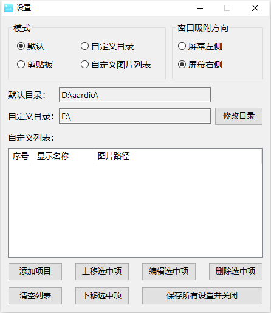

# QuickViewPic
A small tool to view images quickly.

一个简单的快速看图小工具。

程序灵感来自[@hamoyy](https://meta.appinn.net/t/topic/38641)，全部使用[aardio](https://www.aardio.com)编写。

## 使用场景
- 需要重复快速查看指定图片，如查询尺码表。
- 需要将多张截图“钉”在屏幕上，且要求快速来回切换。
## 基本介绍
启动后程序会自动吸附在屏幕边缘，鼠标移动到窗口上则会唤出。

上下移动鼠标可选择项目，同时会在一旁自动显示图片。

最上方的按钮点击即可弹出菜单，可进行设置或退出操作。

设置将在程序退出时自动保存至config.json（剪贴板数据除外）。

## 模式
### 默认
自动从程序启动目录读取图片。

**支持的图片格式**：**jpg**、**png**、**bmp**。（下同）

### 自定义目录
自动从用户选择的目录读取图片。
### 自定义图片列表
由用户自行指定图片的路径及显示顺序。
### 剪贴板
程序支持从剪贴板中导入位图并显示。

获取位图的方式包括但不限于：
- QQ截图工具
- 浏览器页面复制

可反复导入多张位图。

## 注意事项
- 尽量不要浏览太大的图片，可能会导致程序卡顿甚至崩溃。
- 图片像素大小超过屏幕大小时会自动缩小图片，会导致图片失真。
- 程序一旦退出，已缓存的剪贴板数据将会丢失！
## 截图
- 界面：

- 设置界面：

## 演示
- 看图演示：

- 呼出菜单及退出演示：

- 剪贴板看图演示：

## 其它要说的
虽然我跟[@hamoyy](https://meta.appinn.net/t/topic/38641)要了他的源码，不过他之前是用易语言写的，而我上一次用易语言还是几年之前的事情了，因此我没能打开看源码。这个程序是根据我的观察，基于原有的功能先仿制了一个，再根据我个人需要添加了一些功能。

同时这个程序是我第一个发到github上的作品（其实本人也之前写过几个，不过都是给自己用的），希望大家多多支持，帮我测试一下。另外本人并非计算机相关专业的学生，敲代码纯属个人喜好，程序难免会有不足之处，恳请各位指正。
